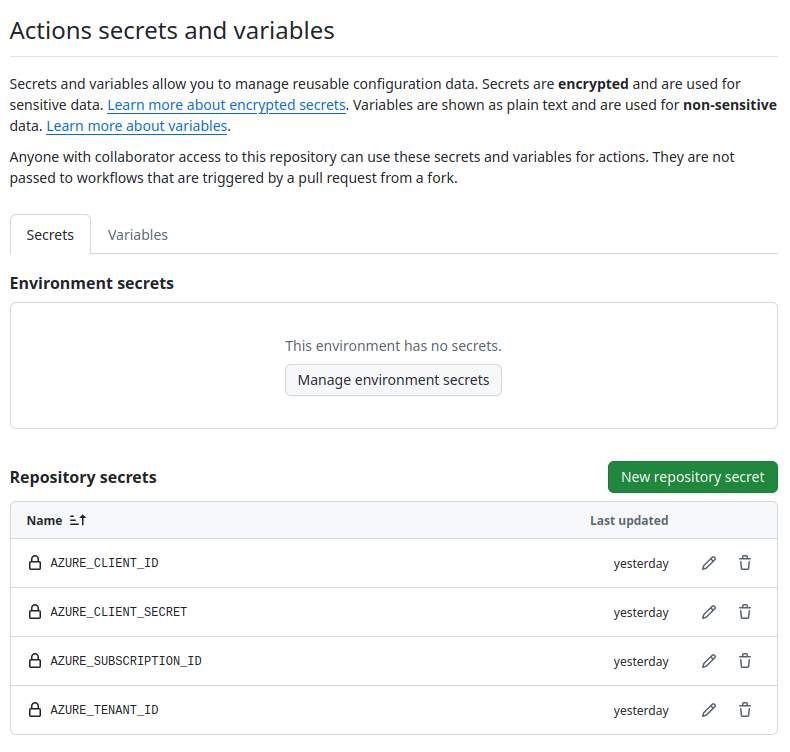

# Documentación Técnica Detallada del Pipeline de CI/CD

## 1. Introducción

Este documento detalla la estructura y el funcionamiento del workflow de GitHub Actions definido en `.github/workflows/main.yml`. El objetivo es explicar el proceso de automatización, desde el disparador inicial hasta el despliegue final en Azure.

## 2. Prerrequisitos y Configuración de Seguridad

Para que el pipeline funcione, se requiere una configuración de seguridad inicial que conecte GitHub con Azure de forma segura.

### 2.1. Creación del Service Principal en Azure

Se crea una identidad de aplicación (Service Principal) en Azure con el rol de "Colaborador" sobre la suscripción. Esto permite a GitHub Actions actuar en nuestro nombre.

```bash
az ad sp create-for-rbac --name "github-actions-cicd" --role "Contributor" --scopes "/subscriptions/TU_SUBSCRIPTION_ID"
```

### 2.2. Configuración de GitHub Secrets

Las credenciales del Service Principal (`clientId`, `clientSecret`, `tenantId`, `subscriptionId`) se guardan como secretos en la configuración del repositorio de GitHub. Esto asegura que no se exponen contraseñas en el código del workflow.



## 3. Análisis del Workflow (`main.yml`)

El workflow se compone de un único trabajo (`job`) que ejecuta una serie de pasos secuenciales para garantizar el orden correcto de las operaciones.

### 3.1. Disparador (`on`)

El pipeline se activa automáticamente con cada `push` a la rama `main`.

### 3.2. Pasos de Ejecución

1.  **Checkout Repository**: Descarga el código fuente del repositorio en el servidor de ejecución de GitHub (runner).
2.  **Log in to Azure**: Utiliza la acción `azure/login` y los secretos de GitHub para autenticar el runner con Azure. A partir de aquí, todos los comandos `az` y `terraform` están autenticados.
3.  **Setup Terraform**: Instala la versión de Terraform especificada.
4.  **Terraform Init**: Inicializa Terraform, descargando los proveedores y configurando el backend remoto en Azure Storage.
5.  **Terraform Apply (ACR Only)**: Se ejecuta un `apply` selectivo con `-target` para crear únicamente el Azure Container Registry. Este paso es crucial para asegurar que el "almacén" de imágenes exista antes de intentar subir una.
6.  **Log in to ACR**: El runner se autentica con el ACR recién creado.
7.  **Get commit SHA**: Se genera una etiqueta única para la imagen de Docker a partir de los 8 primeros caracteres del hash del commit que disparó el workflow.
8.  **Build and Push Docker Image**: Se utiliza la acción `docker/build-push-action` para construir la imagen de la aplicación Flask y subirla al ACR con la etiqueta única generada.
9.  **Terraform Apply (All Resources)**: Se ejecuta un `apply` final y completo. Terraform despliega o actualiza el resto de la infraestructura (ACI, App Gateway, etc.), pasando la nueva etiqueta de la imagen como una variable (`-var="docker_image_tag=..."`) para que la Instancia de Contenedor se actualice con la última versión de la aplicación.

Este flujo de trabajo garantiza que, ante cualquier cambio en el código de la aplicación o de la infraestructura, el entorno en Azure se actualizará de forma automática, segura y predecible.
