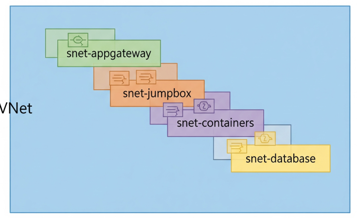

# CI/CD Pipeline para una Aplicación Contenerizada en Azure con Terraform

   

Este repositorio implementa un pipeline completo de **Integración Continua y Despliegue Continuo (CI/CD)** para una aplicación web en contenedores, desde el código fuente hasta la producción en Microsoft Azure.

**➡️ [Ver la Documentación Técnica Detallada del Pipeline](DOCUMENTACION_DETALLADA.md)**

---

### 🚀 Arquitectura y Flujo de Automatización

El proyecto despliega una aplicación Python (Flask) en una arquitectura segura de 3 capas. Todo el ciclo de vida, desde la construcción de la imagen de Docker hasta el aprovisionamiento de la infraestructura con Terraform, está 100% automatizado con **GitHub Actions**.

> **Nota:** El endpoint de la aplicación puede estar desactivado para optimizar los costes de la suscripción de Azure. Este repositorio demuestra el proceso de automatización y la infraestructura como código.

---

### 💡 Logros y Habilidades Demostradas

* **Automaticé el ciclo de vida completo de una aplicación**, logrando que cualquier cambio en el código se refleje en la nube en minutos sin intervención manual, mediante la creación de un **pipeline de CI/CD con GitHub Actions**.

* **Implementé un proceso de Integración Continua (CI)**, asegurando que cada `commit` genere una nueva versión única y trazable del software, utilizando **Docker para construir la imagen** y el SHA del commit de Git como etiqueta inmutable.

* **Orquesté el Despliegue Continuo (CD) de la infraestructura**, garantizando que los recursos en la nube siempre estén sincronizados con el código fuente, ejecutando **Terraform** para aprovisionar y actualizar los servicios de Azure de forma automática.

* **Establecí una autenticación segura y sin contraseñas para el pipeline**, eliminando la necesidad de gestionar credenciales de larga duración en el repositorio, a través de la configuración de un **Service Principal** de Azure con permisos RBAC y su uso mediante **GitHub Secrets**.

* **Gestioné un flujo de trabajo complejo con dependencias**, asegurando que la infraestructura (como el ACR) se cree antes de que la aplicación la necesite, mediante el uso de `terraform apply -target` y la correcta secuenciación de los trabajos en el workflow.

---
